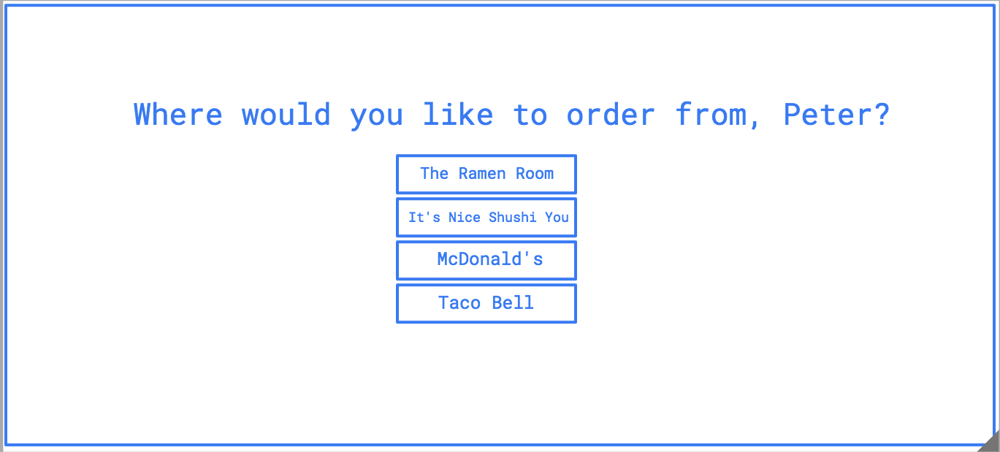

# Project Title: Project #2 - yourEats
    
  ## Table of Contents:

  

  - [Project Description](#project-description)
  - [Installation Instructions](#installation-instructions)
  - [Project Usage Information](#project-usage-information)
  - [Contribution Guidelines](#contribution-guidelines)
  - [Testing Instructions](#testing-instructions)
  - [Github Repo Link](https://github.com/streamingTurtles/project2-HW)
  - [HEROKU Live APP Link](https://radiant-oasis-56969.herokuapp.com/login)
  - [Presentation](https://docs.google.com/presentation/d/11LK9C5VG8Ut8FWZdR-yGGSNjS9RFrwrX1jXMV-3S6hk/edit#slide=id.p)
 

  - - -
  ## Screenshot of Initial wireFrame design for "yourEats" application:
  
  
  
  

  &nbsp;
  - - -
  ## Project Description:
  - This is a group project-2, that developed a menu app for some of your favorite foods.

  &nbsp;
  - - -
  ## Installation Instructions:
  - The user only has to follow the Heroku Deployed Application link https://radiant-oasis-56969.herokuapp.com/login  or can run the application locally from the terminal by first running >npm i to get all dependencies and then to begin the app, type:  >node server.js  and the burger app will open in the browser.

  &nbsp;
  - - -
  ## Project Usage Information:
  - The usage of this application is to demonstrate using such technologies as: Node(server), Express(server/router framework), mySQL(database), and Handlebars(frontEnd framwork) in an MVC design pattern.  This app can be run locally and runs on Heroku - see live link in the TOC.

  &nbsp;
  - - -
  ## Contribution Guidelines:

- - -
- - -
Rajahni Fields, Natalia Carvajal, Margaret Elson, Peter Cardillo, - Project #2, Columbia Engineering Fullstack Bootcamp, 2020-2021  